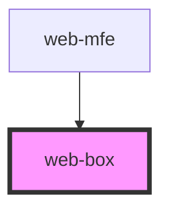

# web-box

<!-- Auto Generated Below -->

## Properties

| Property  | Attribute | Description | Type                                     | Default     |
| --------- | --------- | ----------- | ---------------------------------------- | ----------- |
| `variant` | `variant` |             | `"primary" \| "secondary" \| "tertiary"` | `"primary"` |

## Dependencies

### Used by

 - [web-mfe](../web-mfe)

### Graph

----------------------------------------------

*Built with [StencilJS](https://stenciljs.com/)*
