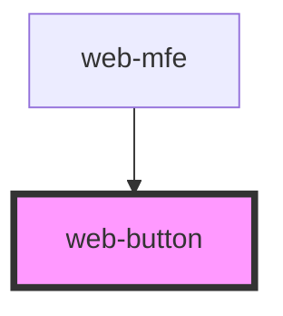

# web-button

<!-- Auto Generated Below -->

## Properties

| Property  | Attribute | Description | Type                                                         | Default     |
| --------- | --------- | ----------- | ------------------------------------------------------------ | ----------- |
| `options` | `options` |             | `"outline" \| "solid"`                                       | `"solid"`   |
| `variant` | `variant` |             | `"on-primary" \| "on-secondary" \| "primary" \| "secondary"` | `"primary"` |

## Dependencies

### Used by

 - [web-mfe](../web-mfe)

### Graph

----------------------------------------------

*Built with [StencilJS](https://stenciljs.com/)*
